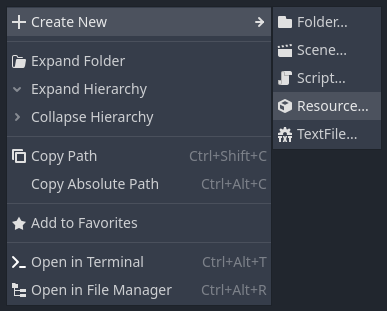
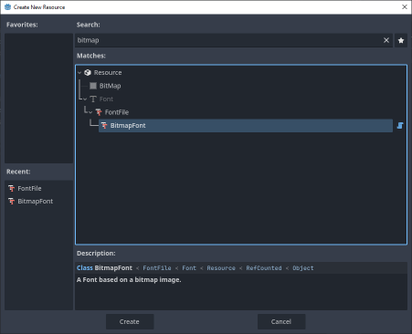
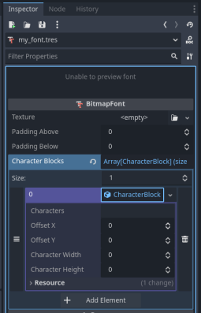
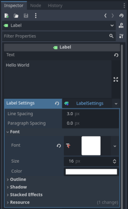

# Bitmap Fonts

Custom Bitmap Font resource addon for Gotdot 4.x., allowing easy definition of bitmap fonts from arbitrary image textures.

After adding this addon to your project, create a new resource of type "BitmapFont".

After creating the resource, double click on it in the FileSystem tab to open it in the inspector.
Set the _Texture_ property to the image of the font.
You will need to define one or more "character blocks" - sets of characters which are represented by the image.
If you have a simple image with fixed-width characters, all in a row horizontally, you will only need to define a single block.
Enter the actual characters (e.g. "ABCD...") in the _characters_ property, the x/y offset where those characters are found in the texture, and the width and height of each character, _including the space after each one_.

Once you've set up your font, you can apply it to UI controls. For a Label control, create a LabelSettings object and then drag the BitmapFont resource into the Font/Font property.

For variable width fonts, Set up a character block for each set of equal width characters. You can see an example of this in the [example project repo](https://github.com/iamcal/godot-bitmap-fonts-example).